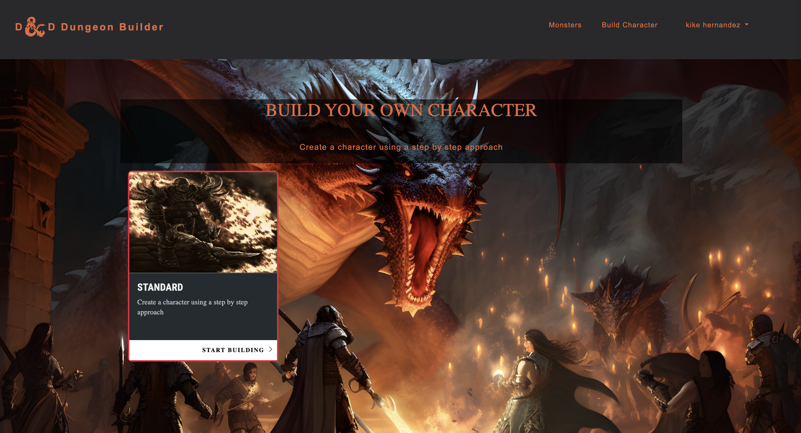
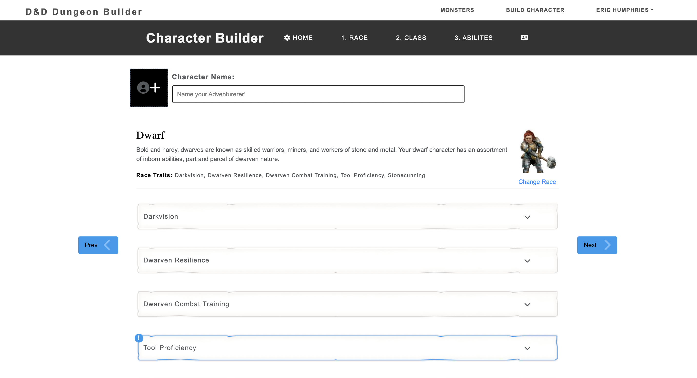
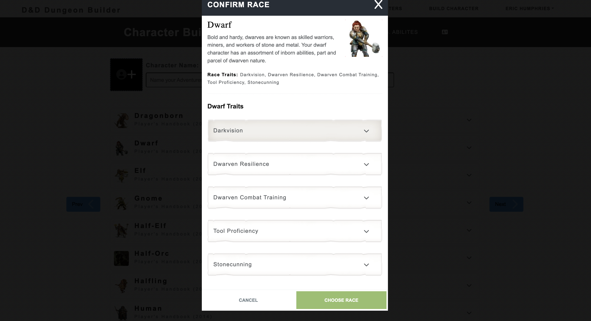

# Project Name

> Dungeon&Dragons Character Builder Application





Built with the MERN stack & Redux.

## Table of Contents

- [Project Name](#project-name)
  - [Table of Contents](#table-of-contents)
  - [Usage](#usage)
  - [Requirements](#requirements)
    - [Env Variables](#env-variables)
    - [Install Dependencies (frontend \& backend)](#install-dependencies-frontend--backend)
    - [Run](#run)
    - [Build \& Deploy](#build--deploy)
    - [Seed Database](#seed-database)
    - [Roadmap](#roadmap)

## Usage

- Create a MongoDB database and obtain your `MongoDB URI` - [MongoDB Atlas](https://www.mongodb.com/cloud/atlas/register)
-

> This is a MERN stack application that allows registered users CRUD functionality to jumpstart creating
> D&D characters. This was a project I started as a Capstone project in completing the Per Scholas MERN stack software engineering bootcamp, and it is currently in an unfinished state

## Requirements

- Node 0.10.x
- Mongo Atlas account, and free-tier Cluster

### Env Variables

Rename the `.env.example` file to `.env` and add the following

```
NODE_ENV = development
PORT=5005
DB_USER= a username of your choice
DB_PASSWORD= a password of your choice
MONGO_URL= your mongodb uri
JWT_SECRET= a string value of your choice
```

### Install Dependencies (frontend & backend)

```
# from project directory
npm install
cd frontend
npm install
```

### Run

```
# Run frontend (:5173) & backend (:5005)
npm run devstart
# Run backend only
npm run server
```

### Build & Deploy

```
# Create frontend prod build
cd frontend
npm run build
```

### Seed Database

You can use the following commands to seed the database with some sample users and products as well as destroy all data

```
# Import data
npm run data:import

# Destroy data
npm run data:destroy
```

### Roadmap

View the project roadmap [here](LINK_TO_PROJECT_ISSUES)
